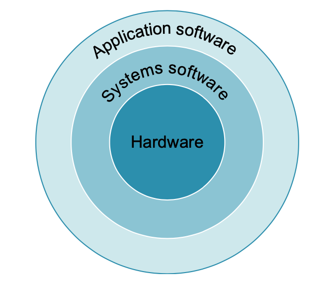
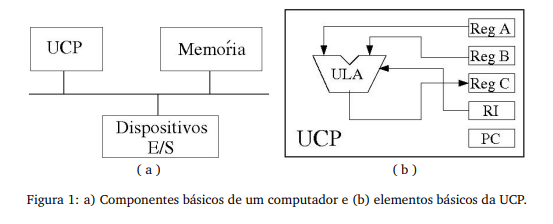

# **Como funciona um computador?**

De uma perspectiva mais simplista, podemos dividir a organização de um computador da seguinte forma:

Sendo a camada mais externa, o software que nós programadores escrevemos, usando linguagens de programação como C, C++, Java, Ruby, Go, etc.

A camada intermediária seria a interface entre nosso software com o hardware de fato, sendo dois grandes exemplos de software de interface os compiladores e os sistemas operacionais.

O papel do sistema operacional normalmente é o de prover diversas APIs ao hardware assim como mandar funções de supervisionamento.

Alguns exemplos de funções importantes do OS (operating system, ou sistema operacional):

- Lidar com I/O
- Alocação de memória e armazenamento (disco)
- Prover uma interface segura para que diferentes aplicações possam utilizar os recursos do computador de maneira simultânea e harmoniosa

Compiladores executam uma tarefa vital também para o funcionamento dos programas, eles “traduzem” programas escritos em linguagens mais alto nível (como C ou Java) em instruções que o hardware consegue executar, chamadas de machine language (ou linguagem de máquina). Alguns compiladores conseguem executar uma tradução direta, outros utilizam um passo intermediário, onde transformam o código alto nível em um de mais baixo nível chamado de assembly, que nada mais é do que uma linguagem que abstrai um pouco a linguagem de máquina (bits) em instruções mais fáceis de um humano entender, porém estando bem mais próximo do jeito que computadores de fato funcionam. O software que consegue converter assembly em linguagem de máquina é normalmente chamado de assembler.

## **As partes de um computador**

A maioria dos computadores segue a arquitetura de von Neumann, que descreve um computador como um
conjunto de trˆes partes principais: a unidade central de processamento ou UCP (que por sua vez ´e composta
pela unidade l´ogico-aritm´etica (ULA) e pela unidade de controle (UC)), a mem´oria e os dispositivos de entrada
e sa´ıda (E/S). Todas as partes s˜ao conectadas por um conjunto de cabos, o barramento. Esses componentes
podem ser vistos na figura a seguir:

A Figura 1.1b mostra uma UCP em uma configuração bastante simples. De forma geral, a UCP pode ser dividida em duas partes: a Unidade Lógica e Aritmética (ULA) e a Unidade de Controle (UC).

A ULA é capaz de desempenhar dois tipos de operações: operações aritméticas, como somas e subtrações, e comparações, como "igual a" ou "maior que". A UC orquestra todo o restante do sistema. Seu trabalho é ler instruções e dados da memória ou dos dispositivos de entrada, decodificar as instruções, alimentar a ULA com as entradas corretas de acordo com as instruções e enviar os resultados de volta à memória ou aos dispositivos de saída.

Um componente-chave do sistema de controle é o Contador de Programa (PC – Program Counter), que mantém o endereço da instrução corrente e que, tipicamente, é incrementado cada vez que uma instrução é executada, a menos que a própria instrução corrente indique onde se encontra a próxima instrução. Isso permite que um conjunto de instruções seja repetido várias vezes.

Desde a década de 1980, a ULA e a UC são integradas em um único circuito integrado: o microprocessador.

Há vários fabricantes e modelos de microprocessadores, como o Pentium, da Intel, o Athlon, da AMD, e o PowerPC, da IBM. Cada microprocessador possui um conjunto finito de instruções, que são executadas a uma determinada frequência. Atualmente, as frequências mais comuns variam entre 1 e 3 GHz (Gigahertz).

O microprocessador apenas busca a próxima instrução (ou dado) na memória e a executa em um ciclo contínuo, que se repete até que o computador seja desligado.

A Figura 1.1b mostra a ULA recebendo informações dos registradores A e B e armazenando o resultado no registrador C. O Registrador de Instruções (RI) define a operação a ser executada. Esses registradores fazem parte da Unidade de Controle. A UC é capaz de configurar seus recursos, como registradores e a própria ULA, para executar cada instrução.

## **I/O**

Os dispositivos de E/S definem como o computador recebe informac¸˜ao do mundo exterior e como ele devolve
informac¸˜ao para o mundo exterior. Teclados, mouses, scanners, microfones e cˆameras s˜ao dispositivos comuns
de entrada enquanto monitores e impressoras s˜ao dispositivos comuns de sa´ıda. Discos r´ıgidos e placas de rede,
que permitem conex˜oes entre computadores, podem atuar como dispositivos tanto de entrada quanto de sa´ıda.

## **Memória**

Memória é basicamente o componente responsável por guardar instruções de programas e dados do computador.
Existem algumas categorias de memórias, sendo a mais comumente conhecida a DRAM (dynamic random access memory). RAM (random access memory) é um termo utilizado para denominar unidades de armazenamento que levam o mesmo tempo para acessar qualquer parte desta unidade, ou seja, não importa em qual parte o dado se encontra, fisicamente, ele pode ser acessado no mesmo intervalo de tempo.

Dentro do processador encontramos um outro tipo de memória chamada de Cache, uma memória extremamente rápida, que é utilizada como um buffer da DRAM (um buffer nada mais é do que um espaço onde dados que são mais frequentemente utilizados são guardados, sendo este um local de maior performance, economizado outros recursos e tornando o computador mais eficiente como um todo). A tecnologia utilizada para construir um Cache do processador é chamada de SRAM (static random access memory), uma tecnologia muito mais rápida do que a DRAM, porém mais cara.

Tanto a DRAM quanto a SRAM são tecnologias de memória voláteis, ou seja, assim que a energia do computador é cortada elas são completamente apagadas. Tendo esta característica em mente, surgiu a necessidade de termos um espaço diferente no computador para armazenarmos dados persistentes, assim surgiram os discos magnéticos, uma tecnologia de armazenamento de longo prazo, onde os dados ficam gravados mesmo quando não há energia no computador. Posteriormente, principalmente com o advento de dispositivos mobiles, um segundo tipo de tecnologia de armazenamento de local prazo surgiu como alternativa, o flash memory, sendo bem utilizado por conta de seu tamanho físico e custo por bits.

Na hierarquia de memória, chamamos DRAM / SRAM de memória primária, enquanto flash memory e discos magnéticos são categorizados como memória secundária.

## **A interface entre hardware e o software**

Um dos princípios fundamentais da arquitetura de computadores é que abstrações simplificam o design. Isso significa que ao utilizar abstrações, programadores e arquitetos podem se comunicar de forma mais eficaz. Um dos avanços significativos na área da computação foi ocultar os detalhes de implementação do hardware, expondo apenas um modelo simples e padronizado para que os programadores pudessem escrever seus programas.

Uma das mais importantes abstrações é a interface entre hardware e software, que chamamos de instruction set architecture (ISA). A ISA é formada por uma série de instruções que o computador é capaz de executar, como operações aritméticas, I / O e etc.

Tipicamente, temos o sistema operacional que encapsula detalhes de como fazer I / O, alocar memória e outras funções mais baixo nível, para que programadores não tenham que se preocupar com isto. A combinação de instruções básicas e a API fornecida pelo sistema operacional é chamada de application binary interface.

## **ISA e Assembly**

A ISA caracteriza o que um hardware pode fazer, ou seja, inclui todas as instruções que uma CPU pode executar, endereço de seus registradores, o modelo de memória utilizado, como instruções são decodificadas, etc. A linguagem assembly é uma linguagem de programação que corresponde muito proximamente as instruções da ISA (Lembrando que as instruções da ISA normalmente são codificadas como um binário que representa determinada instrução específica).

A relação entre a ISA e o assembly é que o assembly proporciona uma representação passível de compreensão por humanos da ISA de determinado hardware.

##### Bibliografia

> Como um computador funciona? Disponível em: https://dev.to/erick_tmr/como-um-computador-funciona-4me9. Acesso em: 30 de maio de 2026.

#### Histórico de Versões

| Versão |    Data    | Descrição                                 | Autor(es)                                       | Revisor(es)                                    |
| ------ | :--------: | ----------------------------------------- | ----------------------------------------------- | ---------------------------------------------- |
| 1.0    | 30/05/2026 | Criação do documento                        | [Harryson](https://github.com/harry-cmartin) |       |

