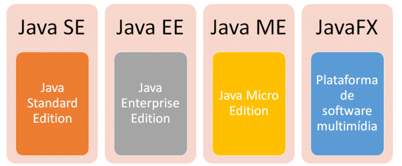
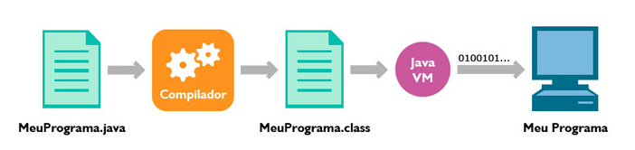
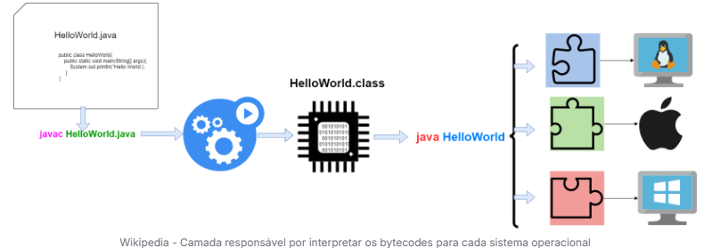

# **Plataformas**

Com a linguagem Java conseguimos desenvolver softwares para várias finalidades de negócio. Seja uma aplicação desktop, uma distribuição web, eletrônicos e dispositivos móveis.

Isso graças a distribuição dos recursos da linguagem através de plataformas bem estruturadas.

## **Plataformas da linguagem Java**

A linguagem Java conta com quatro ambientes de desenvolvimento

- **JSE (Java Standard Edition):** É a base da plataforma. Inclui o ambiente de execução e as bibliotecas comuns, sendo direcionado a aplicações para PCs e servidores. O toolkit Swing, por exemplo, é usado para desenvolver softwares com interface gráfica para desktop.

- **JEE (Java Enterprise Edition):** A edição voltada para o desenvolvimento de aplicações corporativas e para a Web. Possui diversos frameworks, como JPA (Java Persistence API), JSP (Java Server Pages), etc.

- **JME (Java Micro Edition):** É a edição para o desenvolvimento de aplicações para dispositivos móveis e embarcados.

- **JFX (Java FX):** JavaFX é uma tecnologia de software que, ao ser combinada com Java, permite a criação e implantação de aplicações de aparência moderna e conteúdo rico de áudio e vídeo.

## **Componentes da Plataforma**

Agora que já sabemos que podemos desenvolver para vários cenários de negócio, é hora de conhecer as ferramentas de desenvolvimento da linguagem:

O Java se subdivide em componentes de desenvolvimento (JDK) e de execução (JRE). Isso significa que, para desenvolver aplicações, é necessário ter instalado o JDK. Mas para apenas iniciar o executável (.jar) simplesmente a instalação da JRE será o suficiente.

**JDK (Java Development Kit) - Kit de Desenvolvimento Java**

- Composto pelo Compilador (javac + JVM)

- Visualizador de applets, bibliotecas de desenvolvimento

- Programa para composição de documentação (javadoc)

- Depurador básico de programas e versão da JRE.

**JRE (Java Runtime Environment) - Ambiente de Execução Java**

- É composta de uma JVM e por um conjunto de bibliotecas que permite a execução de softwares em Java.

- Apenas permite a execução de programas, ou seja é necessário o programa Java compilado pela JDK gerando os arquivos .class

## **Processo de desenvolvimento**

- Todo código-fonte escrito em arquivo texto possui extensão .java
- Este arquivo é compilado com o javac gerando o arquivo .class
- O arquivo .class não contém código de máquina nativo, e sim o bytecodes.

## **JVM - Java Virtual Machine**

Máquina virtual Java (em inglês: Java Virtual Machine, JVM) é um programa que carrega e executa os aplicativos Java, convertendo os bytecodes em código executável de máquina. A JVM é responsável pelo gerenciamento dos aplicativos, à medida que são executados.

Graças à máquina virtual Java, os programas escritos em Java podem funcionar em qualquer plataforma de hardware e software que possua uma versão da JVM, tornando assim essas aplicações independentes da plataforma onde funcionam.

#### Bibliografia 

>  

#### Histórico de Versões

| Versão |    Data    | Descrição                                 | Autor(es)                                       | Revisor(es)                                    |
| ------ | :--------: | ----------------------------------------- | ----------------------------------------------- | ---------------------------------------------- |
| 1.0    | 30/05/2026 | Criação do documento                        | [Harryson](https://github.com/harry-cmartin) |       |
