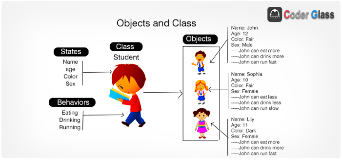
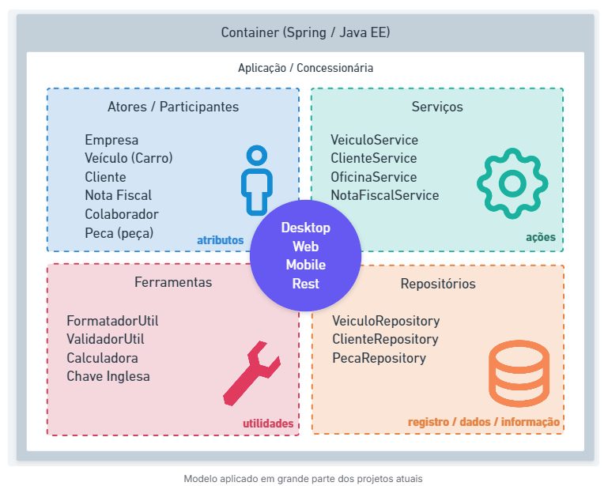

# **Classes e Objetos**

## **Classes**

Toda a estrutura de código na linguagem Java é distribuído em arquivos com extensão .java denominados de classe.

As classes existentes em nosso projeto serão composta por:

**Identificador, Características e Comportamentos**.

- Classe (class): A estrutura e ou representação que direciona a criação dos objetos de mesmo tipo.

- Identificador (identity): Propósito existencial aos objetos que serão criados.

- Características (states): Também conhecido como atributos ou propriedades, é toda informação que representa o estado do objeto.

- Comportamentos (behavior): Também conhecido como ações ou métodos, é toda parte comportamental que um objeto dispõe.

- Instanciar (new): É o ato de criar um objeto a partir de estrutura definida em uma classe.

---



Para ilustrar as etapas de desenvolvimento orientada a objetos em Java, será reproduzida a imagem acima em forma de código para explicar que primeiro criamos a estrutura correspondente para assim podermos cria-los com as características e possibilidade de realização de ações (comportamentos) como se fosse no "mundo real".

---

```java
// Criando a classe Student
// Com todas as características e compartamentos aplicados

public class Student {
    String name;
    int age;
    Color color;
    Sex sex;

    void eating(Food food){
      //NOSSO CÓDIGO AQUI
    }
    void drinking(Eat eat){
      //NOSSO CÓDIGO AQUI
    }
    void running(){
      //NOSSO CÓDIGO AQUI
    }
}

```

---

```java

// Criando objetos a partir da classe Student

public class School {
    public static void main(String[] args) throws Exception {
      Student student1 = new Student();
      student1.name= "John";
      student1.age= 12;
      student1.color= Color.FAIR;
      student1.sex= Sex.MALE;

      Student student2 = new Student();
      student2.name= "Sophia";
      student2.age= 10;
      student2.color= Color.FAIR;
      student2.sex= Sex.FEMALE;

      Student student3 = new Student();
      student3.name= "Lily";
      student3.age= 11;
      student3.color= Color.DARK;
      student3.sex= Sex.FEMALE;
    }
}

```

!!! warning
No exemplo acima, **NÃO** estruturamos a classe `Student` com o padrão Java Beans **getters** e **setters**.

---

Seguindo algumas convenções, as nossas classes são classificadas como:

| Tipo de Classe               | Descrição                                                                                                                      |
| ---------------------------- | ------------------------------------------------------------------------------------------------------------------------------ |
| **Modelo (model)**           | Classes que representem estrutura de domínio da aplicação, exemplo: Cliente, Pedido, Nota Fiscal e etc.                        |
| **Serviço (service)**        | Classes que contém regras de negócio e validação de nosso sistema.                                                             |
| **Repositório (repository)** | Classes que contém uma integração com banco de dados.                                                                          |
| **Controle (controller)**    | Classes que possuem a finalidade de disponibilizar alguma comunicação externa à nossa aplicação, tipo http web ou webservices. |
| **Utilitária (util)**        | Classe que contém recursos comuns à toda nossa aplicação.                                                                      |





#### Bibliografia

>

#### Histórico de Versões

| Versão |    Data    | Descrição            | Autor(es)                                    | Revisor(es) |
| ------ | :--------: | -------------------- | -------------------------------------------- | ----------- |
| 1.0    | 30/05/2026 | Criação do documento | [Harryson](https://github.com/harry-cmartin) |             |
